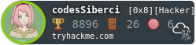

<h1>
     Hey, nice to see you.
</h1>
              

Welcome to my page!   I'm Ahmet, Pull-Stack developer from <b>İstanbul, Turkey</b>

<h3>Things I code with</h3>

    
    
    
    
    
    
     
     
    
     

<h3>Where to find me:</h3>

    
    
    
    
    
     

 

### ⚙️ &nbsp;GitHub Analytics

### 📝 My Latest Medium Articles - [@codescaptain](https://medium.com/@codescaptain)

